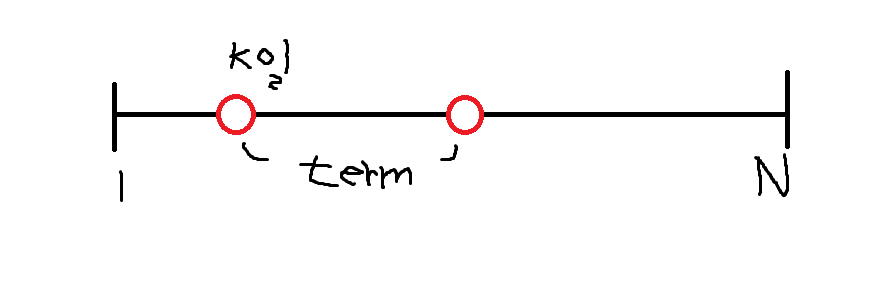

# 퇴사

## 문제

상담원으로 일하고 있는 백준이는 퇴사를 하려고 한다.

오늘부터 N+1일째 되는 날 퇴사를 하기 위해서, 남은 N일 동안 최대한 많은 상담을 하려고 한다.

백준이는 비서에게 최대한 많은 상담을 잡으라고 부탁을 했고, 비서는 하루에 하나씩 서로 다른 사람의 상담을 잡아놓았다.

각각의 상담은 상담을 완료하는데 걸리는 기간 Ti와 상담을 했을 때 받을 수 있는 금액 Pi로 이루어져 있다.

N = 7인 경우에 다음과 같은 상담 일정표를 보자.

|      | 1일  | 2일  | 3일  | 4일  | 5일  | 6일  | 7일  |
| :--- | :--- | :--- | :--- | :--- | :--- | :--- | :--- |
| Ti   | 3    | 5    | 1    | 1    | 2    | 4    | 2    |
| Pi   | 10   | 20   | 10   | 20   | 15   | 40   | 200  |

1일에 잡혀있는 상담은 총 3일이 걸리며, 상담했을 때 받을 수 있는 금액은 10이다. 5일에 잡혀있는 상담은 총 2일이 걸리며, 받을 수 있는 금액은 15이다.

상담을 하는데 필요한 기간은 1일보다 클 수 있기 때문에, 모든 상담을 할 수는 없다. 예를 들어서 1일에 상담을 하게 되면, 2일, 3일에 있는 상담은 할 수 없게 된다. 2일에 있는 상담을 하게 되면, 3, 4, 5, 6일에 잡혀있는 상담은 할 수 없다.

또한, N+1일째에는 회사에 없기 때문에, 6, 7일에 있는 상담을 할 수 없다.

퇴사 전에 할 수 있는 상담의 최대 이익은 1일, 4일, 5일에 있는 상담을 하는 것이며, 이때의 이익은 10+20+15=45이다.

상담을 적절히 했을 때, 백준이가 얻을 수 있는 최대 수익을 구하는 프로그램을 작성하시오.

## 입력

첫째 줄에 N (1 ≤ N ≤ 15)이 주어진다.

둘째 줄부터 N개의 줄에 Ti와 Pi가 공백으로 구분되어서 주어지며, 1일부터 N일까지 순서대로 주어진다. (1 ≤ Ti ≤ 5, 1 ≤ Pi ≤ 1,000)

## 출력

첫째 줄에 백준이가 얻을 수 있는 최대 이익을 출력한다


## 풀이

DP를 이용하여 답을 구할 수 있는 문제이다.



그림과 같이 K일에 상담을 하였을 때, term만큼은 상담을 할 수 없고, k+term일 부터 상담을 시작 할 수 있다. 그렇다면 우리가 구현해야할 것은 K일까지 얻을 수 있는 최대 이익을 dp[k]에 저장해놓은 후 dp[k+term]부터 dp[n]까지 dp[k]+pay 값을 저장하면 된다. 물론 이미 dp에 들어있는 값이 dp[k]+pay보다 클 경우는 값을 그대로 유지하면 된다.

```c++
#include <iostream>
using namespace std;

struct WORK {
	int term;
	int pay;
};

int dp[50];
WORK a[50];

int main()
{
	cin.tie(0);
	ios::sync_with_stdio(0);

	int n;

	cin >> n;

	for (int i = 0; i < n; i++)
	{
		cin >> a[i].term >> a[i].pay;
	}

	for (int i = 0; i < n; i++)
	{
		if (a[i].term + i + 1 <= n)
		{
			for (int j = a[i].term + i + 1; j <= n; j++)
			{
				if (dp[j] < dp[i+1] + a[i].pay)
					dp[j] =dp[i+1]+ a[i].pay;
			}
		}
	}

	cout << dp[n];

	return 0;
}
```

그러나 이런식으로 코드를 짤 계속해서 Wrong Answer가 나와 무언가 틀린점이 있나 싶었다. 다시 문제를 보니 N+1일 까지는 일을 할 수 있었다... 그래서 코드를 아래와 같이 수정하니 정답이 나왔다.

```c++
#include <iostream>
#include <algorithm>
using namespace std;

struct WORK {
	int term;
	int pay;
};

int dp[50];
WORK a[50];

int main()
{
	cin.tie(0);
	ios::sync_with_stdio(0);

	int n;

	cin >> n;

	for (int i = 1; i <= n; i++)
	{
		cin >> a[i].term >> a[i].pay;
	}

	for (int i = 1; i <= n; i++)
	{
		if (a[i].term + i <= n+1)
		{
			for (int j = a[i].term + i; j <= n+1; j++)
			{
				if (dp[j] < dp[i] + a[i].pay)
					dp[j] =dp[i]+ a[i].pay;
			}
		}
	}

	cout << dp[n + 1];
	return 0;
}
```

문제를 항상 잘 읽고 풀어야 한다는 생각을 다시한번 하게 되었다.
