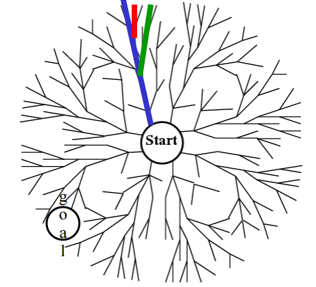
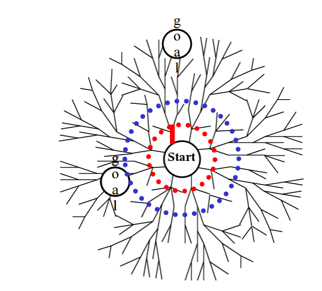

Reference : [블로그](https://blog.ilkyu.kr/entry/%EC%9D%B8%EA%B3%B5%EC%A7%80%EB%8A%A5-%EB%AC%B4%EC%A0%95%EB%B3%B4%ED%83%90%EC%83%89Uninformed-Search)

**무정보탐색(Uninformed Search)** 이란 아래의 두가지 조건을 가진 탐색과정이다. 
1. 목표 상태공간까지의 정보(도달까지 필요한 횟수 또는 비용 등)는 모른다.
2. 어떤 상태 공간이 목표 상태공간인지 구분 할 수 있다.

무정보 탐색을 위한 탐색방법은 크게 아래와 같은 4가지 방법이 있다.
1. BFS
2. Uniform Cost Search
3. DFS
4. Iterative Deepening

위에서 BFS와 Uniform Cost Search는 queue를 기반으로 한다는 공통점이 있지만 일반 queue를 쓰는 BFS와 달리 Uniform Cost Searh는 priority_queue를 이용하여 가중치가 있는 그래프에서도 최적해(Minimum cost path)를 구할 수 있다. 위의 두 방식은 다음에 다시 정리해보자.

Iterative Deepening은 DFS와 BFS를 합쳐놓은것같은 방식을 사용한다.
탐색 방식은 DFS를 이용하여 탐색을 하되 BFS처럼 깊이에 제한을 둔다.

이러한 방식을 이용하는 이유는 DFS의 탐색 방식이 깊이에 제한이 있을경우 공간복잡도가 O(bm)으로 매우 효율적인 반면 깊이에 제한이 없을경우 탐색이 종료되지 않기 때문에 무정보 탐색에서는 깊이에 임의로 제한을 두고 진행을 하는 Interative Deepening방식이 매우 효율적으로 작동한다. ( b = "한 깊이 내려갈 때 마다 평균적으로 뻗어나가야 하는 줄기의 평균 갯수[branching factor]", m = "그래프의 깊이")

DFS와 BFS의 시간, 공간 복잡도에 대해선 다시한번 정리해야 할듯하다.

**DFS 진행방식**

**Iterative Deepening 진행방식**

